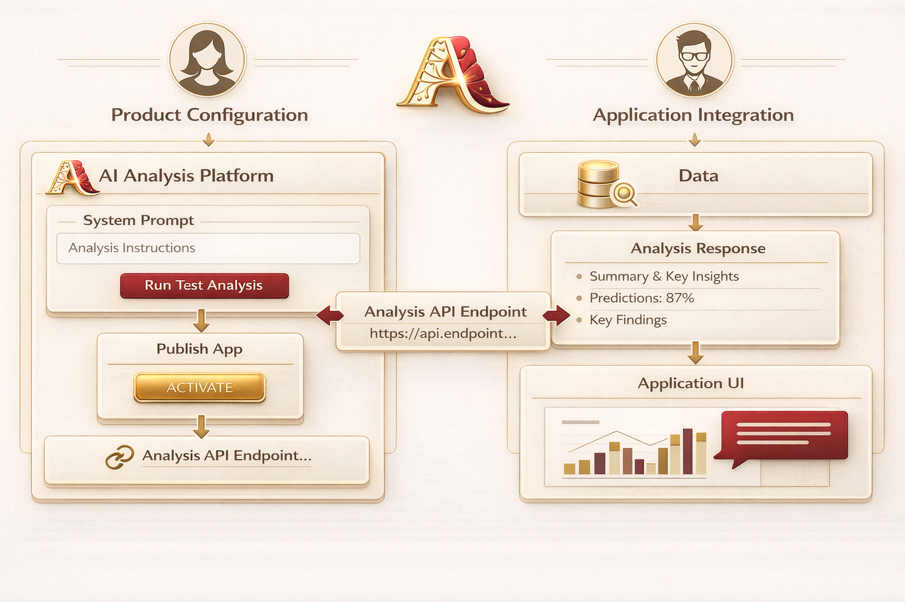

# Alysis — Self-Hosted AI Analysis Platform

Build, manage, and run AI-powered analysis apps with ease.


---

## Overview

**Alysis** is a self-hosted platform for creating and executing AI analysis applications. Define your prompts, connect to OpenAI, Anthropic, or Google Gemini, and expose them as secure API endpoints — all with built-in versioning, logging, and statistics.



---

## Key Features

- **Multi-Provider AI** — Switch between OpenAI, Anthropic, and Google Gemini
- **Prompt Versioning** — Full version control with draft → active → deprecated workflow
- **Prompt Testing** — Test prompts directly before publishing
- **API Key Auth** — Secure endpoints with auto-generated API keys per app
- **Vendor Key Management** — Store AI provider keys in database or use environment variables
- **Execution Logs** — Complete audit trail of all requests and responses
- **Token Stats** — Track usage, latency, and cost across all your apps
- **Response Formats** — Support for both JSON and text response formats
- **Swagger Docs** — Interactive API documentation at `/docs`
- **Docker Ready** — One command to deploy the entire stack

---

## Quick Start

### Option 1: Docker (Recommended)

```bash
docker-compose up -d
```

The `-d` flag runs containers in detached mode (in the background), freeing up your terminal. Use `docker-compose logs -f` to view logs, and `docker-compose down` to stop the stack.

Your stack is now running:

| Service      | URL                        |
| ------------ | -------------------------- |
| **Frontend** | http://localhost:80        |
| **Backend**  | http://localhost:3001      |
| **API Docs** | http://localhost:3001/docs |
| **Postgres** | localhost:5432             |

### Option 2: Local Development

**Prerequisites:** [Bun](https://bun.sh) (v1.3.5+), Node.js (v22+), PostgreSQL

```bash
# Terminal 1 — Backend
cd backend && bun install && bun run dev

# Terminal 2 — Frontend
cd frontend && npm install && npm run dev
```

---

## Tech Stack

| Component    | Technology                                 |
| ------------ |--------------------------------------------|
| **Runtime**  | Bun                                        |
| **Backend**  | Elysia                                     |
| **Frontend** | React 19 + Vite + TailwindCSS + shadcn/ui  |
| **Database** | PostgreSQL 16                              |
| **ORM**      | Drizzle ORM                                |
| **AI**       | OpenAI SDK, Anthropic SDK, Google GenAI SDK |
| **Data**     | TanStack Query                             |

---

## API Usage

Once you've created and activated an app through the UI, use this endpoint to execute it:

```
POST /api/v1/analyze/:appId
```

**Headers:**
| Header | Required | Description |
|--------------------|----------|------------------------------------------|
| `X-API-Key` | Yes | API key generated when app was created |
| `X-Caller-Service` | No | Identifier for your calling service |

**Request:**

```json
{
  "input": {
    "data": "your data"
  }
}
```

**Response:**

```json
{
  "id": "log_xyz",
  "output": { "result": "..." },
  "status": "success",
  "latencyMs": 342,
  "tokenUsage": { "prompt": 25, "completion": 10, "total": 35 }
}
```

**Example:**

```bash
curl -X POST http://localhost:3001/api/v1/analyze/e-comm-G9fDp \
  -H "Content-Type: application/json" \
  -H "X-API-Key: ak_xxxx..." \
  -d '{"input": {"data": "I love this product!"}}'
```

Full API documentation available at `/docs` (Swagger UI).

---

## Configuration

### Environment Variables

| Variable            | Description                  | Default     |
| ------------------- | ---------------------------- | ----------- |
| `DATABASE_URL`      | PostgreSQL connection string | Required    |
| `OPENAI_API_KEY`    | OpenAI API key               | Optional    |
| `ANTHROPIC_API_KEY` | Anthropic API key            | Optional    |
| `GEMINI_API_KEY`    | Google Gemini API key        | Optional    |
| `PORT`              | Backend server port          | 3001        |
| `NODE_ENV`          | Environment mode             | development |

### Supported Models

**OpenAI:** `gpt-5.2`, `gpt-4o`

**Anthropic:** `claude-opus-4-5-20251101`, `claude-sonnet-4-20250514`

**Google Gemini:** `gemini-3-pro-preview`, `gemini-2.5-flash`

---

## Project Structure

```
/
├── docker-compose.yml        # Stack orchestration
├── backend/                  # Bun + Elysia API
│   ├── src/
│   │   ├── clients/          # AI provider clients (OpenAI, Anthropic, Gemini)
│   │   ├── controllers/      # API route handlers
│   │   ├── db/               # Drizzle schema & migrations
│   │   ├── repositories/     # Data access layer
│   │   ├── services/         # Business logic
│   │   ├── types/            # TypeScript types
│   │   └── index.ts          # App entry point
│   └── Dockerfile
├── frontend/                 # React App
│   ├── src/
│   │   ├── components/       # UI components (shadcn/ui)
│   │   ├── hooks/            # Custom React hooks
│   │   ├── lib/              # Utilities
│   │   └── pages/            # Route pages
│   └── Dockerfile
└── README.md
```

---

## Database Schema

| Table             | Description                                  |
| ----------------- | -------------------------------------------- |
| `analyses`        | Analysis apps with name, description, status |
| `prompt_versions` | Versioned prompts with model config          |
| `execution_logs`  | Request/response audit trail                 |
| `api_keys`        | Per-app API keys for authentication          |
| `vendor_api_keys` | Stored AI provider keys (encrypted)          |

---

## Contributing

Contributions are welcome! Fork the repo, create a feature branch, and submit a PR.

---

## License

MIT License
