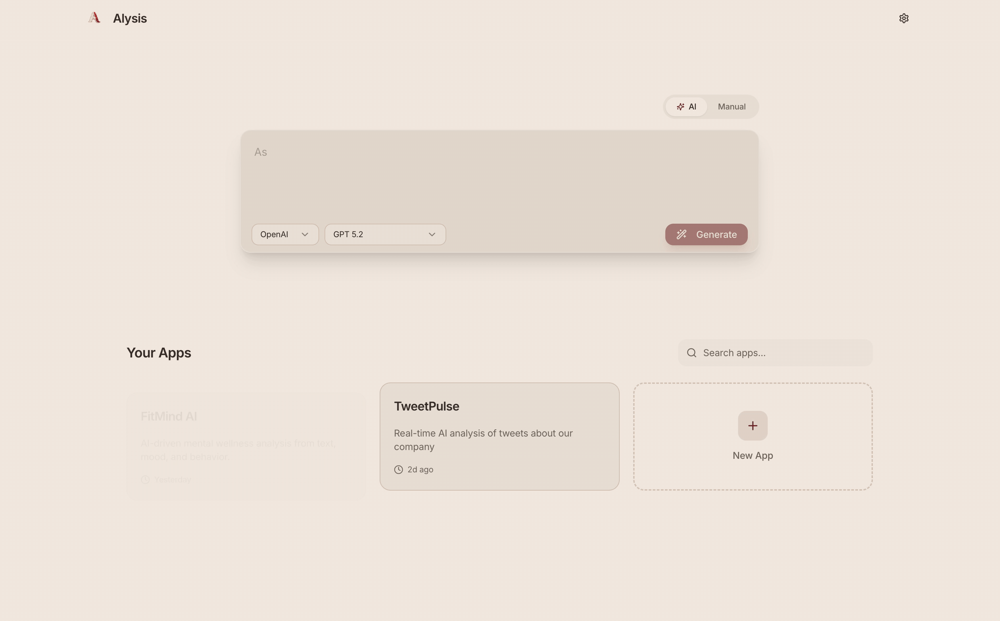
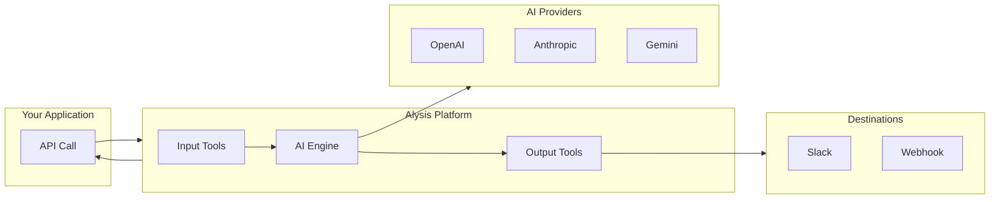

<div align="center">

# Alysis

### Turn AI prompts into production APIs — in minutes, not weeks.

[](https://bun.sh)
[](https://elysiajs.com)
[](https://react.dev)
[](https://postgresql.org)
[](LICENSE)

**Self-hosted AI analysis platform with prompt management, tool integrations, and scheduled execution.**

[Getting Started](#-quick-start) · [Features](#-features) · [API Reference](#-api-reference) · [Documentation](#-documentation)



</div>

---

## 🎯 The Problem

Product teams are getting better at prompt engineering. They know what analysis to run and what customers should see. But turning prompts into production APIs still requires:

- Managing AI provider SDKs across services
- Building infrastructure for versioning, testing, and rollbacks
- Connecting to data sources for enriched analysis
- Setting up observability for cost and performance tracking

**Alysis solves this.** One platform to build, test, deploy, and monitor AI-powered analysis — with tools and scheduling built in.

---

## ✨ Features

<table>
<tr>
<td width="50%">

### 🤖 AI App Generation

Don't write prompts from scratch. Describe what you want, and AI generates:

- ✅ The system prompt
- ✅ Sample input data for testing
- ✅ App name and description

Just review, edit if needed, and save.

</td>
<td width="50%">

### 🔌 Input & Output Tools

Connect your apps to external data and destinations:

**Input Tools**
- HTTP Request — fetch data from APIs
- Snowflake — query data warehouses
- PostgreSQL — query databases

**Output Tools**
- Slack — send insights to channels
- Webhook — push results to any endpoint

</td>
</tr>
<tr>
<td width="50%">

### ⏱️ Scheduled Execution

Run your AI apps automatically:

- Cron-based scheduling
- Timezone support
- Execution history and logs
- Output tools trigger on completion

</td>
<td width="50%">

### 📊 Full Observability

Track everything that matters:

- Token usage and costs per execution
- Latency metrics across versions
- Complete audit trail
- Version comparison analytics

</td>
</tr>
</table>

---

## 🚀 Quick Start

### Docker (Recommended)

```bash
docker-compose up -d
```

That's it. Your stack is running:

| Service | URL |
|---------|-----|
| **Frontend** | http://localhost:80 |
| **Backend API** | http://localhost:3001 |
| **API Docs** | http://localhost:3001/docs |
| **Tool Catalog** | http://localhost:80/tools |

### Local Development

```bash
# Backend
cd backend && bun install && bun run dev

# Frontend (new terminal)
cd frontend && npm install && npm run dev
```

---

## 🏗️ How It Works


```mermaid
flowchart LR
    subgraph YourApp[Your Application]
        API[API Call]
    end
    
    subgraph Alysis[Alysis Platform]
        direction TB
        Tools[Input Tools]
        Engine[AI Engine]
        Output[Output Tools]
        Tools --> Engine
        Engine --> Output
    end
    
    subgraph Providers[AI Providers]
        OpenAI[OpenAI]
        Anthropic[Anthropic]
        Gemini[Gemini]
    end
    
    subgraph Destinations[Destinations]
        Slack[Slack]
        Webhook[Webhook]
    end
    
    API --> Alysis
    Engine --> Providers
    Output --> Destinations
    Alysis --> API
```

1. **Create an app** — Write a prompt or let AI generate one
2. **Attach tools** — Connect data sources for input enrichment
3. **Test & publish** — Validate with sample data, then go live
4. **Call or schedule** — Execute via API or set up automated runs
5. **Monitor** — Track costs, latency, and outputs

---

## 👥 Who Is This For?

### For Product Teams

| Feature | Benefit |
|---------|---------|
| Visual Prompt Editor | Iterate on prompts without touching code |
| AI App Generation | Go from idea to working app in seconds |
| Version Control | Every edit creates a version; roll back anytime |
| Test Playground | Validate prompts before publishing |
| Cost Tracking | See exactly what each execution costs |

### For Developers

| Feature | Benefit |
|---------|---------|
| Simple API | One endpoint, JSON in, JSON out |
| No SDK Required | Alysis handles all AI provider complexity |
| TypeScript Interfaces | Auto-generated types from responses |
| Tool Augmentation | Data injected as `_tool_<name>` keys |
| Swagger Docs | Full API documentation at `/docs` |

---

## 🔌 Tools & Integrations

### Input Tools

Enrich your AI analysis with external data:

```
┌─────────────────┐     ┌─────────────────┐     ┌─────────────────┐
│   Snowflake     │     │   PostgreSQL    │     │   HTTP API      │
│   ❄️ Warehouse  │     │   🐘 Database   │     │   🌐 REST       │
└────────┬────────┘     └────────┬────────┘     └────────┬────────┘
         │                       │                       │
         └───────────────────────┼───────────────────────┘
                                 ▼
                    ┌─────────────────────────┐
                    │     AI Analysis App     │
                    │   (enriched with data)  │
                    └─────────────────────────┘
```

### Output Tools

Send results where they matter:

| Tool | Description |
|------|-------------|
| **Slack** | Post insights directly to channels via webhook |
| **Webhook** | Push JSON results to any HTTP endpoint |

---

## 📡 API Reference

### Generate App with AI

```bash
POST /api/v1/apps/magic
```

```json
{
  "description": "Analyze customer support tickets and categorize by theme",
  "vendor": "openai",
  "model": "gpt-4o"
}
```

**Response:**

```json
{
  "name": "support-ticket-analyzer",
  "description": "Categorizes support tickets by theme",
  "systemPrompt": "You are an expert analyst...",
  "sampleData": "Customer: I can't login to my account..."
}
```

### Execute Analysis

```bash
curl -X POST http://localhost:3001/api/v1/analyze/my-app-id \
  -H "Content-Type: application/json" \
  -H "X-API-Key: aak_your_key_here" \
  -d '{"input": {"text": "Your data here"}}'
```

**Response:**

```json
{
  "id": "exec_abc123",
  "output": { "category": "billing", "sentiment": "frustrated" },
  "status": "success",
  "latencyMs": 342,
  "tokenUsage": { "prompt": 150, "completion": 45, "total": 195 }
}
```

### Schedule an App

```bash
PUT /api/v1/apps/:appId/schedule
```

```json
{
  "cronExpression": "0 9 * * *",
  "timezone": "America/New_York",
  "enabled": true,
  "inputData": { "source": "daily_report" }
}
```

### Key Endpoints

| Endpoint | Description |
|----------|-------------|
| `POST /api/v1/apps` | Create a new app |
| `POST /api/v1/apps/magic` | Generate app with AI |
| `POST /api/v1/analyze/:appId` | Execute an app |
| `PUT /api/v1/apps/:appId/schedule` | Configure schedule |
| `GET /api/v1/tool-definitions` | List available tools |
| `POST /api/v1/tool-instances` | Create tool connection |

Full documentation at **`/docs`** (Swagger UI)

---

## 🛠️ Tech Stack

| Layer | Technology |
|-------|------------|
| **Runtime** | [Bun](https://bun.sh) — Fast JavaScript runtime |
| **Backend** | [Elysia](https://elysiajs.com) — TypeScript web framework |
| **Frontend** | React 19 + Vite + TailwindCSS + shadcn/ui |
| **Database** | PostgreSQL 16 + [Drizzle ORM](https://orm.drizzle.team) |
| **AI Providers** | OpenAI, Anthropic, Google Gemini |
| **Data Fetching** | TanStack Query |
| **UI Components** | Radix UI + Recharts + Framer Motion |

---

## 📁 Project Structure

```
alysis/
├── docker-compose.yml          # Full stack orchestration
├── backend/
│   └── src/
│       ├── modules/
│       │   ├── app/            # App CRUD & management
│       │   ├── prompt/         # Prompt versioning
│       │   ├── execution/      # Execution logs
│       │   ├── schedule/       # Scheduled tasks
│       │   ├── tool-*/         # Tool system (definitions, instances, execution)
│       │   └── api-key/        # Authentication
│       ├── clients/            # AI provider clients
│       └── db/                 # Drizzle schema
└── frontend/
    └── src/
        ├── pages/              # Route components
        ├── features/app/       # App feature module
        ├── components/         # Shared components
        └── lib/                # API client & utilities
```

---

## ⚙️ Configuration

### Environment Variables

| Variable | Description | Required |
|----------|-------------|----------|
| `DATABASE_URL` | PostgreSQL connection string | Yes |
| `OPENAI_API_KEY` | OpenAI API key | No* |
| `ANTHROPIC_API_KEY` | Anthropic API key | No* |
| `GEMINI_API_KEY` | Google Gemini API key | No* |
| `PORT` | Backend port | No (default: 3001) |

*At least one AI provider key required. Can also be configured via UI.

### Supported Models

| Provider | Models |
|----------|--------|
| **OpenAI** | gpt-4o, gpt-4-turbo |
| **Anthropic** | claude-3-opus, claude-3-sonnet |
| **Google** | gemini-1.5-pro, gemini-1.5-flash |

---

## 🤝 Contributing

Contributions welcome! Please read our contributing guidelines before submitting PRs.

1. Fork the repository
2. Create a feature branch (`git checkout -b feature/amazing-feature`)
3. Commit your changes (`git commit -m 'Add amazing feature'`)
4. Push to the branch (`git push origin feature/amazing-feature`)
5. Open a Pull Request

---

## 📄 License

MIT License — see [LICENSE](LICENSE) for details.

---

<div align="center">

**[⬆ Back to Top](#alysis)**

Built with ❤️ for teams who want AI in production, not just in notebooks.

</div>
