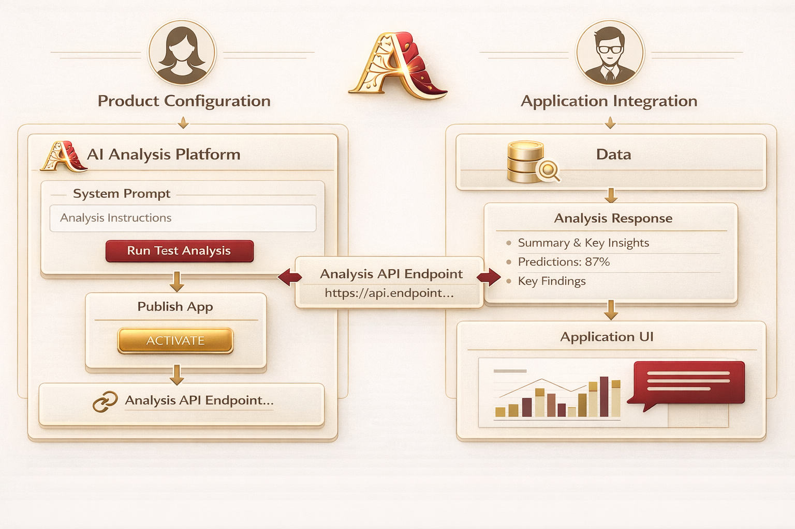

# Alysis — Self-Hosted AI Analysis Platform

Build, manage, and run AI-powered analysis apps with ease.


---

## Overview

**Alysis** is a self-hosted platform for creating and executing AI analysis applications. Define your prompts, connect to OpenAI, Anthropic, or Google Gemini, and expose them as secure API endpoints — all with built-in versioning, logging, and statistics.



---

## Key Features

**Alysis is a self-hosted solution that combines the best of LiteLLM and LangFuse** — giving you prompt management, multi-provider AI support, and observability in one platform.

### For Product Teams: Prompt Engineering & Testing
- **Interactive Playground** — Build and refine prompts with real-time testing
- **Multi-Provider AI** — Test across OpenAI, Anthropic, and Google Gemini without code changes
- **Cost & Performance Visibility** — See exactly how much each execution costs and how long it takes
- **Version Comparison** — Compare latency and pricing across different prompt versions
- **Sample Data Management** — Save test inputs for consistent iteration
- **Publish When Ready** — Once satisfied, turn your prompt into a production API endpoint

### For Developers: Simple Integration
- **No AI Client Code Required** — Don't manage OpenAI/Anthropic/Gemini SDKs yourself
- **Send Data → Get Analysis** — Your only job: pass your data to the API and receive structured analysis
- **TypeScript Interfaces Provided** — Auto-generated type definitions from actual AI responses
- **Production-Ready Code** — Copy cURL commands and integration snippets from Dev Space
- **API Key Authentication** — Secure endpoints with per-app keys
- **Complete Documentation** — Interactive Swagger docs at `/docs`

### Self-Hosted & Secure
- **Full Control** — Deploy on your infrastructure, keep your data private
- **Vendor Key Management** — Store AI provider keys securely or use environment variables
- **Execution Logs** — Complete audit trail of all requests and responses
- **Docker Ready** — One command to deploy the entire stack

---

## Quick Start

### Option 1: Docker (Recommended)

```bash
docker-compose up -d
```

The `-d` flag runs containers in detached mode (in the background), freeing up your terminal. Use `docker-compose logs -f` to view logs, and `docker-compose down` to stop the stack.

Your stack is now running:

| Service      | URL                        |
| ------------ | -------------------------- |
| **Frontend** | http://localhost:80        |
| **Backend**  | http://localhost:3001      |
| **API Docs** | http://localhost:3001/docs |
| **Postgres** | localhost:5432             |

### Option 2: Local Development

**Prerequisites:** [Bun](https://bun.sh) (v1.3.5+), Node.js (v22+), PostgreSQL

```bash
# Terminal 1 — Backend
cd backend && bun install && bun run dev

# Terminal 2 — Frontend
cd frontend && npm install && npm run dev
```

---

## Tech Stack

| Component    | Technology                                                      |
| ------------ |-----------------------------------------------------------------|
| **Runtime**  | Bun                                                             |
| **Backend**  | Elysia + Swagger                                                |
| **Frontend** | React 19 + Vite + TailwindCSS + shadcn/ui + Framer Motion       |
| **Database** | PostgreSQL 16                                                   |
| **ORM**      | Drizzle ORM                                                     |
| **AI**       | OpenAI SDK, Anthropic SDK, Google GenAI SDK                     |
| **Data**     | TanStack Query                                                  |
| **UI/UX**    | Radix UI + Recharts + Sonner + Lucide Icons                     |

---

## UI Features

The frontend is built with a modern, feature-based architecture for maximum maintainability:

- **Feature-Based Organization** — Modular components organized by domain (analysis, execution, etc.)
- **Responsive Design** — Mobile-optimized layouts with adaptive UI components
- **Real-Time Updates** — TanStack Query for automatic data synchronization
- **Accessible Components** — Built on Radix UI primitives for WCAG compliance
- **Animated Transitions** — Smooth micro-interactions powered by Framer Motion
- **Data Visualization** — Interactive charts and analytics via Recharts
- **Toast Notifications** — Non-intrusive feedback using Sonner
- **40+ UI Components** — Complete shadcn/ui component library included

---

## API Usage

Once you've created and activated an app through the UI, use this endpoint to execute it:

```
POST /api/v1/analyze/:appId
```

**Headers:**
| Header | Required | Description |
|--------------------|----------|------------------------------------------|
| `X-API-Key` | Yes | API key generated when app was created |
| `X-Caller-Service` | No | Identifier for your calling service |

**Request:**

```json
{
  "input": {
    "data": "your data"
  }
}
```

**Response:**

```json
{
  "id": "log_xyz",
  "output": { "result": "..." },
  "status": "success",
  "latencyMs": 342,
  "tokenUsage": { "prompt": 25, "completion": 10, "total": 35 }
}
```

**Example:**

```bash
curl -X POST http://localhost:3001/api/v1/analyze/e-comm-G9fDp \
  -H "Content-Type: application/json" \
  -H "X-API-Key: ak_xxxx..." \
  -d '{"input": {"data": "I love this product!"}}'
```

Full API documentation available at `/docs` (Swagger UI).

### Dev Space

The UI includes a built-in Dev Space that automatically generates ready-to-use integration code:

- **cURL Commands** — Copy production-ready cURL snippets with your API key
- **TypeScript Interfaces** — Auto-generated type definitions from AI responses
- **Sample Data Integration** — Pre-populated requests using your saved sample data

Access Dev Space by clicking the terminal icon in the analysis detail view.

---

## Configuration

### Environment Variables

| Variable            | Description                  | Default     |
| ------------------- | ---------------------------- | ----------- |
| `DATABASE_URL`      | PostgreSQL connection string | Required    |
| `OPENAI_API_KEY`    | OpenAI API key               | Optional    |
| `ANTHROPIC_API_KEY` | Anthropic API key            | Optional    |
| `GEMINI_API_KEY`    | Google Gemini API key        | Optional    |
| `PORT`              | Backend server port          | 3001        |
| `NODE_ENV`          | Environment mode             | development |

### Supported Models

**OpenAI:** `gpt-5.2`, `gpt-4o`

**Anthropic:** `claude-opus-4-5-20251101`, `claude-sonnet-4-20250514`

**Google Gemini:** `gemini-3-pro-preview`, `gemini-2.5-flash`

---

## Project Structure

```
/
├── docker-compose.yml        # Stack orchestration
├── backend/                  # Bun + Elysia API
│   ├── src/
│   │   ├── clients/          # AI provider clients (OpenAI, Anthropic, Gemini)
│   │   ├── modules/          # Feature modules (analysis, prompt, execution, etc.)
│   │   │   ├── analysis/     # Analysis domain (controller, service, repository)
│   │   │   ├── prompt/       # Prompt versioning domain
│   │   │   ├── execution/    # Execution logs domain
│   │   │   ├── api-key/      # API key management
│   │   │   ├── vendor-key/   # Vendor API key management
│   │   │   └── dev-tools/    # Developer tools
│   │   ├── db/               # Drizzle schema & migrations
│   │   ├── config/           # Configuration (model pricing, etc.)
│   │   ├── shared/           # Shared types & interfaces
│   │   ├── utils/            # Utilities
│   │   └── index.ts          # App entry point
│   └── Dockerfile
├── frontend/                 # React 19 App
│   ├── src/
│   │   ├── features/         # Feature-based organization
│   │   │   └── analysis/     # Analysis feature module
│   │   │       ├── components/ # AppCard, PromptEditor, StatsGrid, DevSpaceSheet, etc.
│   │   │       └── hooks/    # useTestRunner, usePromptEditor, useInlineEdit, etc.
│   │   ├── components/ui/    # shadcn/ui components (40+ components)
│   │   ├── layouts/          # Layout components (BackgroundEffects)
│   │   ├── pages/            # Route pages (AnalysesList, AnalysisDetail)
│   │   ├── hooks/            # Shared hooks (useRelativeTime, useMobile)
│   │   └── lib/              # Utilities (api.ts, type-generators.ts)
│   └── Dockerfile
└── README.md
```

---

## Database Schema

| Table             | Description                                            |
| ----------------- | ------------------------------------------------------ |
| `analyses`        | Analysis apps with name, description, status, and sample data |
| `prompt_versions` | Versioned prompts with model config and interfaces     |
| `execution_logs`  | Request/response audit trail with token usage          |
| `api_keys`        | Per-app API keys for authentication                    |
| `vendor_api_keys` | Stored AI provider keys (encrypted)                    |

---

## Contributing

Contributions are welcome! Fork the repo, create a feature branch, and submit a PR.

---

## License

MIT License
